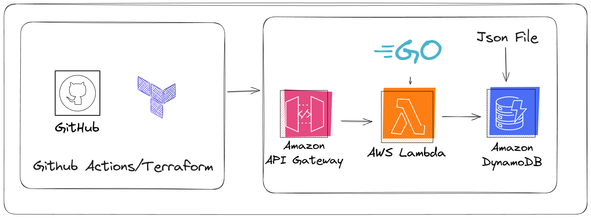

# Cloud-Resume-API

## Diagram

## Details

This is my latest project I've done. The project objective is to create a endpoint that returns resume information that is in JSON format. You use a cloud of your choice to create the infrastructure on. I chose AWS as I am more comfortable with it. All of the services I used are listed below. I had previous experience in Terraform so most of the services I used I am pretty comfortable with them. I think the most challenging thing was getting the JSON file uploaded and formatted into the Dynamodb Table.

## Services Used

- Api-Gateway
- Lambda Function
- Dynamodb
- Terraform
- Github Actions
- Go

## Links

- Github : [Github](https://github.com/loggerboy9325/cloud-resume-api)
- API-Link : [API-Link](https://ry5dzf3ztf.execute-api.us-east-1.amazonaws.com/prod/cloud-resume)
- Challenge-Website : [Challenge-Website](https://cloudresumeapi.dev/aws/)
